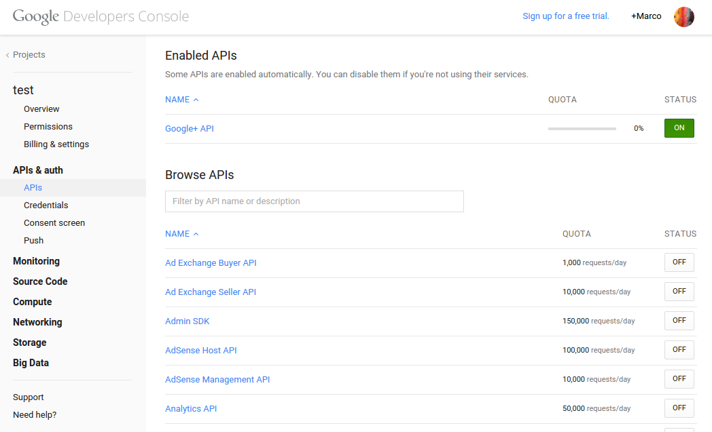

Configure
=========

Settings
--------

1. `Configure django-cms <http://django-cms.readthedocs.org/en/latest/how_to/integrate.html>`_
2. Add ``cmsplugin_googleplus`` and ``'django.contrib.humanize'`` to the ``INSTALLED_APPS`` list in your project's ``settings.py``.

Cache
-----

The activities are cached so you need to:

1. `Set up your cache system <https://docs.djangoproject.com/en/dev/topics/cache/#setting-up-the-cache>`_
2. (Optional) Decide the activities cache duration. Default is 5 minutes.
   Inside ``settings.py`` add::

       GOOGLEPLUS_PLUGIN_CACHE_DURATION = <custom_cache_duration>

Google
------

1. Go to the `google apis console <https://console.developers.google.com/project>`_ and create a new project or select an existent one (a google account is required)
2. Select *APIs* under *APIs & Auth* and activate *Google+ API*

3. Select *Credentials* and *Create new Key* (Browser key)
4. Add the *API key* to your plugin instance::

The actual 'Courtesy Limit' for the Google+ API is 10,000 requests/day