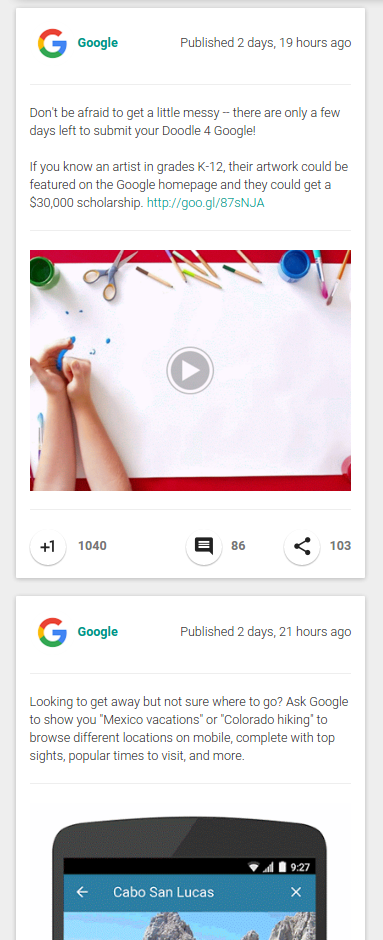

.. cmsplugin-googleplus documentation master file, created by
   sphinx-quickstart on Sun Feb  8 17:28:23 2015.
   You can adapt this file completely to your liking, but it should at least
   contain the root `toctree` directive.

Welcome to cmsplugin-googleplus's documentation!
================================================

Django-cms plugin for fetching Google+ activities.

An `activity <https://developers.google.com/+/api/latest/activities>`_ is a note that a user posts to their stream.
You can `list <https://developers.google.com/+/api/latest/activities/list>`_ a collection of activities
from one user or you can list a collection of activities
as result of a `search <https://developers.google.com/+/api/latest/activities/search>`_.

Info
----

.. image:: https://img.shields.io/pypi/status/cmsplugin-googleplus.svg?style=plastic
    :target: https://pypi.python.org/pypi/cmsplugin-googleplus/
    :alt: Development Status: Beta

.. image:: https://img.shields.io/pypi/v/cmsplugin-googleplus.svg?style=plastic
    :target: https://pypi.python.org/pypi/cmsplugin-googleplus/
    :alt: Latest Version

.. image:: https://img.shields.io/pypi/dm/cmsplugin-googleplus.svg?style=plastic
    :target: https://pypi.python.org/pypi/cmsplugin-googleplus/
    :alt: Downloads

.. image:: https://img.shields.io/pypi/l/cmsplugin-googleplus.svg?style=plastic
    :target: https://pypi.python.org/pypi/cmsplugin-googleplus/
    :alt: License

.. image:: https://img.shields.io/pypi/wheel/cmsplugin-googleplus.svg?style=plastic
    :target: https://pypi.python.org/pypi/cmsplugin-googleplus/
    :alt: Wheel Status

.. image:: https://img.shields.io/pypi/pyversions/cmsplugin-googleplus.svg?style=plastic
    :target: https://pypi.python.org/pypi/cmsplugin-googleplus/
    :alt: Supported Python Versions

|

Continuous Integration
----------------------

.. image:: https://img.shields.io/travis/itbabu/cmsplugin-googleplus/master.svg?style=plastic
    :target: https://travis-ci.org/itbabu/cmsplugin-googleplus/
    :alt: Build Status

.. image:: https://img.shields.io/coveralls/itbabu/cmsplugin-googleplus/master.svg?style=plastic
    :alt: Coverage Status
    :target: https://coveralls.io/r/itbabu/cmsplugin-googleplus?branch=master

|

Contents
--------

.. toctree::
   :maxdepth: 1

   install
   configure
   templates
   tests
   translations

Preview
-------

This is how the plugin looks with the example template.

Have Fun!

Marco
